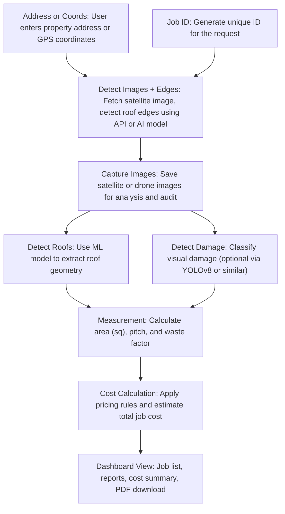

# 🏗️ Roof Measurement App - Development Plan
The Roof Measurement App is a web-based platform designed to help roofing professionals instantly calculate roof areas, slopes, and estimated project costs using satellite imagery and machine learning, this app empowers sales teams, contractors, and estimators to skip manual measurements and deliver fast, accurate estimates with minimal effort.

The goal is to build a fast, user-friendly solution that simplifies roof assessments while providing tools like PDF reports, quote calculators, and damage detection as optional enhancements. The app will use Python (FastAPI) for backend and image analysis, and React.js for a responsive frontend experience.

This document outlines the end-to-end plan including features, architecture, technologies, and phased delivery using an MVP-first approach — allowing us to deliver quickly and improve based on real user feedback.

## 🧩 Project Overview

* **Purpose:** Provide instant roof measurements using satellite imagery.
* **Target Users:** Roofing professionals, sales teams, estimators.
* **Key Features:** Satellite image input, roof area calculation, pitch estimation, waste factor, report generation, quote calculator, optional damage detection.

---

## 🧭 Flow Architecture (From Diagram)

---

## 🗺️ Development Roadmap (Stage Chart)

| Stage                                     | Description                                             | Technologies                         | Deliverables                          |
| ----------------------------------------- | ------------------------------------------------------- | ------------------------------------ | ------------------------------------- |
| **1. Requirements & Planning**            | Define MVP, roles, APIs, and data models                | Notion, Figma, Miro                  | Product spec doc, wireframes          |
| **2. UI/UX Design**                       | Build page layouts, user flows, component systems       | Figma                                | High-fidelity design mockups          |
| **3. Frontend Setup**                     | Scaffold project, setup routing, layout, auth pages     | React.js, TailwindCSS                | React app boilerplate                 |
| **4. Address Input & Map UI**             | User inputs address, map renders, marker draggable      | React-Leaflet / Mapbox GL            | Functional map + input flow           |
| **5. Backend Setup**                      | Set up Python backend with REST API                     | FastAPI                              | Auth endpoints, DB setup              |
| **6. Satellite Image Fetching**           | Use APIs to pull high-res roof images by address        | Google Maps API, Bing, or Mapbox     | Image endpoint + display on frontend  |
| **7. Manual Marker Workflow**             | User adjusts roof marker; send coords to backend        | React, state management              | Polygon drawing + submit flow         |
| **8. AI Roof Detection (Optional MVP++)** | Use ML model to detect roof outline + pitch             | PyTorch, OpenCV                      | Roof detection service (microservice) |
| **9. Area & Pitch Calculation**           | Calculate roof area and pitch from coordinates or image | Numpy, Shapely, Geospatial logic     | Area (sq) + pitch response            |
| **10. Damage Detection**                  | Optional: image classification of roof defects          | YOLOv8, vision models                | Detect damage labels and confidence   |
| **11. Report Generation**                 | Generate downloadable report (PDF) with measurements    | Python (reportlab, WeasyPrint)       | Branded PDF reports                   |
| **12. Quote Calculator**                  | Enter pricing rules, calculate job quote from roof data | Python logic, React calculator UI    | Interactive pricing tool              |
| **13. User Auth & Subscription**          | Sign-up/login, plan selection, access control           | Firebase Auth / JWT / Stripe         | User accounts, Stripe integration     |
| **14. Dashboard & History**               | View past jobs, re-download reports, status             | MongoDB / PostgreSQL                 | User dashboard page                   |
| **15. Admin Tools**                       | Admin panel for analytics, usage, feedback              | React Admin, Charts                  | Admin dashboard (basic)               |
| **16. Testing & QA**                      | Unit/integration testing, performance, bug fixes        | PyTest, Jest, Cypress                | Fully tested MVP                      |
| **17. Deployment**                        | Live deployment with CI/CD, backups                     | Vercel (frontend), AWS/GCP (backend) | Deployed app + docs                   |

---

## ⚙️ Tech Stack Summary

### 🔧 Backend (Python)
......

### 🎨 Frontend (React.js)

* **React + Vite** – Frontend app
* **TailwindCSS** – UI design
* **React-Leaflet / Mapbox GL JS** – Map integration
* **React Hook Form / Zod** – Form handling + validation

### ☁️ DevOps
......

---

## 📦 Deliverables by Milestone

### 📍 MVP

* Address-to-measurement flow
* Roof area calculator
* PDF report download
* User login + dashboard

### 🚀 Post-MVP Enhancements

* AI-based auto roof detection
* Damage classification
* Quote & financing calculator
* Admin analytics tools

---

## 📌 Next Steps

1. Finalize product spec & wireframes
2. Choose imagery provider (Google, Mapbox, Nearmap,...)
3. Begin backend (Python) and frontend (React) scaffolding
